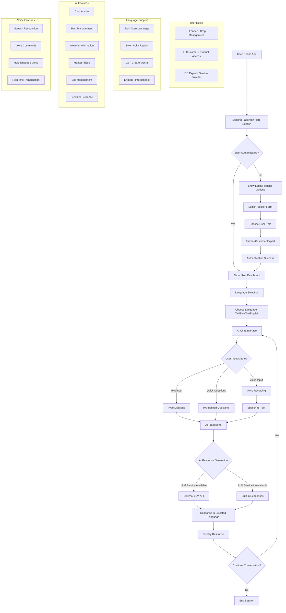
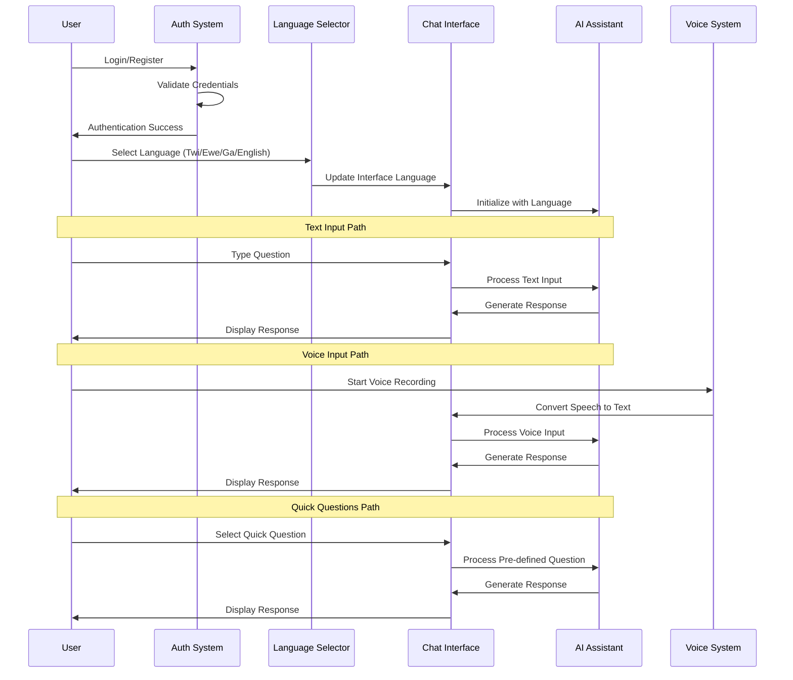
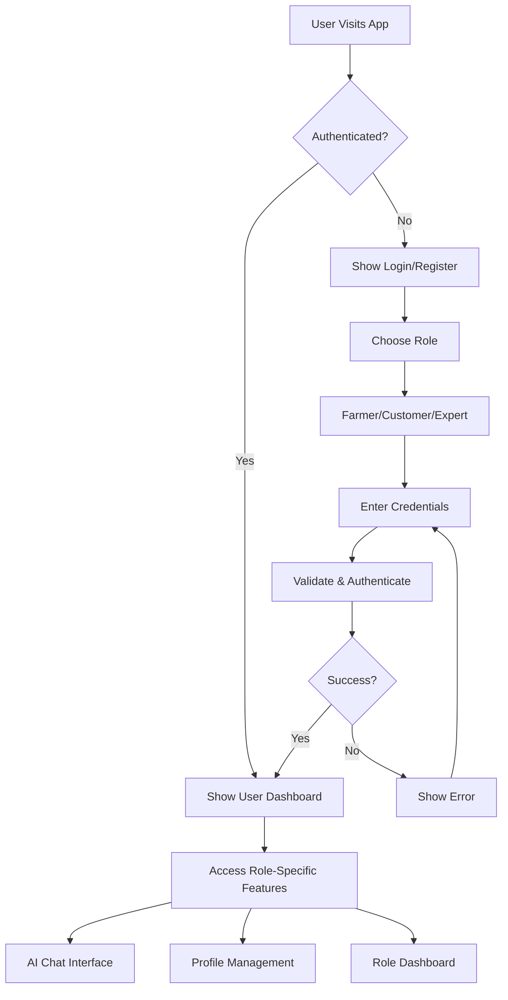
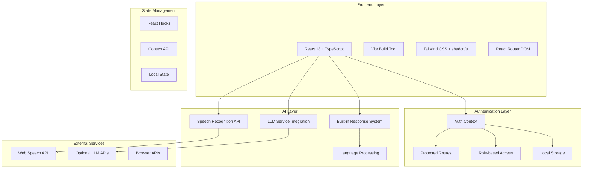
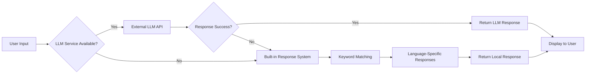
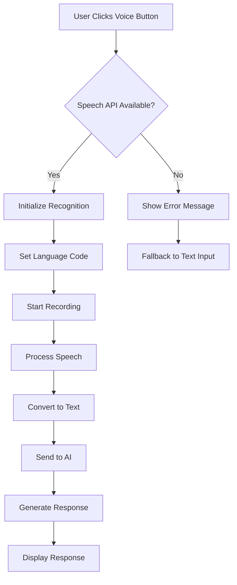

# Agribot - Farm Talk Ghana 🌾🇬🇭

**Agribolt** - Multilingual Agricultural AI Assistant

## Project Overview

Agribot is a cutting-edge AI-powered agricultural assistant designed specifically for Ghanaian farmers. It bridges communication gaps in Ghana's agriculture sector by providing multilingual support in Twi, Ewe, Ga, and English.

## Application Flow



## User Journey Flow



### Key Features
- 🤖 **AI Agricultural Assistant** - Get instant answers about crops, pests, and farming techniques
- 🔊 **AI Voice Channel** - Give voice commands to AI for various farming tasks
- 🎤 **Voice Communication** - Speak in your local language and get responses
- 🌍 **Multi-language Support** - Available in Twi, Ewe, Ga, and English
- 💳 **Payment System** - Secure payments for agricultural services and products
- 📱 **Modern UI/UX** - Beautiful Ghana-themed design with agricultural colors
- 🎯 **Smart Response System** - Fallback from external LLM to built-in responses
- 🔄 **Real-time Language Switching** - Seamless language transitions
- 📊 **Quick Question Buttons** - Pre-defined agricultural queries
- 🔐 **User Authentication** - Secure login system with role-based access
- 👥 **Multi-role Support** - Farmers, Customers, and Service Experts

### Target Users
- Ghanaian farmers who need agricultural advice
- Extension officers providing farming support
- Agricultural customers seeking market information
- Anyone needing farming guidance in local languages

## Authentication System

### User Roles

#### 🌾 **Farmer**
- **Access**: Crop management, farming advice, market information
- **Features**: 
  - AI agricultural assistance
  - Weather alerts and crop timing
  - Market price tracking
  - Pest management guidance
  - Soil health monitoring

#### 🛒 **Customer**
- **Access**: Product browsing, farmer connections, quality assurance
- **Features**:
  - Browse agricultural products
  - Connect with local farmers
  - Quality assurance tracking
  - Delivery monitoring
  - Payment processing

#### 👨‍🌾 **Service Expert**
- **Access**: Expert consultations, service management, knowledge sharing
- **Features**:
  - Provide expert agricultural advice
  - Manage consultation services
  - Share knowledge and best practices
  - Quality control oversight
  - Service scheduling

### Authentication Flow



### Demo Accounts

For testing purposes, the following demo accounts are available:

| Role | Email | Password | Features |
|------|-------|----------|----------|
| 🌾 Farmer | `farmer@agribot.com` | Any password | Crop management, AI assistance |
| 🛒 Customer | `customer@agribot.com` | Any password | Product browsing, farmer connections |
| 👨‍🌾 Expert | `expert@agribot.com` | Any password | Expert consultations, service management |

## Technology Architecture



## Getting Started

### Prerequisites
- Node.js (version 18 or higher)
- npm or yarn package manager
- Modern browser with Web Speech API support

### Installation

1. **Clone the repository**
   ```bash
   git clone https://github.com/AkakpoErnest/Agribot-.git
   cd Agribot-
   ```

2. **Install frontend dependencies**
   ```bash
   npm install
   ```

3. **Set up the backend server**
   ```bash
   # Navigate to backend directory
   cd backend
   
   # Install backend dependencies
   npm install
   
   # Start the backend server
   npm run dev
   ```

4. **Set up environment variables**
   ```bash
   # In the root directory, create .env file
   echo "VITE_API_BASE_URL=http://localhost:3001/api" > .env
   ```

5. **Start the frontend development server**
   ```bash
   # In the root directory
   npm run dev
   ```

6. **Open your browser**
   Navigate to `http://localhost:5173` to view the application

### Backend Setup

The application includes a complete backend API for real authentication:

#### Quick Backend Start
```bash
cd backend
npm install
npm run dev
```

#### Backend Features
- 🔐 **JWT Authentication** - Secure token-based authentication
- 👥 **User Management** - Register, login, profile management
- 🛡️ **Password Hashing** - Secure password storage with bcrypt
- ✅ **Input Validation** - Request validation with express-validator
- 🔄 **Token Refresh** - Automatic token refresh mechanism

#### API Endpoints
- `POST /api/auth/register` - Register new user
- `POST /api/auth/login` - Login user
- `GET /api/auth/profile` - Get user profile
- `PUT /api/auth/profile` - Update user profile
- `POST /api/auth/refresh` - Refresh token
- `POST /api/auth/logout` - Logout user

For detailed backend documentation, see [backend/README.md](backend/README.md).

### Available Scripts

- `npm run dev` - Start development server
- `npm run build` - Build for production
- `npm run build:dev` - Build for development
- `npm run preview` - Preview production build
- `npm run lint` - Run ESLint

### Backend Scripts
- `cd backend && npm run dev` - Start backend in development mode
- `cd backend && npm start` - Start backend in production mode

## LLM Integration

Agribot supports multiple free LLM providers for intelligent agricultural assistance:

### **🤖 Available LLM Providers:**

1. **Hugging Face Inference API** (Recommended - Free)
   - Get free API key: https://huggingface.co/settings/tokens
   - Add to `.env`: `REACT_APP_HUGGINGFACE_API_KEY=your_key_here`

2. **Ollama** (Local - Completely Free)
   - Install: `brew install ollama`
   - Run: `ollama run llama2:7b`
   - No API key needed

3. **Fallback System** (Built-in)
   - Pre-programmed agricultural responses
   - Works offline
   - Multilingual support

### **🚀 Setup Instructions:**

1. **For Hugging Face (Recommended):**
   ```bash
   # Create .env file
   echo "REACT_APP_HUGGINGFACE_API_KEY=your_key_here" > .env
   ```

2. **For Ollama (Local):**
   ```bash
   # Install Ollama
   brew install ollama
   
   # Download and run model
   ollama run llama2:7b
   ```

3. **Start the app:**
   ```bash
   npm run dev
   ```

### **🌾 LLM Features:**
- **Multilingual responses** in Twi, Ewe, Ga, and English
- **Agricultural expertise** tailored for Ghanaian farming
- **Context-aware** responses based on user queries
- **Fallback system** ensures responses even without internet
- **Provider switching** automatically tries different LLMs

## Technology Stack

This project is built with modern web technologies:

### Frontend Framework
- **React 18** with TypeScript for type safety
- **Vite** for fast development and building
- **React Router DOM** for client-side routing

### Styling & UI
- **Tailwind CSS** with custom Ghana theme
- **shadcn/ui** for consistent component library
- **Lucide React** for beautiful icons
- **Custom gradients** and Ghana-themed colors

### State Management
- **React Hooks** for local state management
- **React Query** for data fetching and caching
- **Context API** for global state

### Authentication
- **Custom Auth Context** for user management
- **Protected Routes** for role-based access
- **Local Storage** for session persistence
- **Role-based UI** for different user types

### AI & Voice Features
- **Web Speech API** for speech recognition
- **Custom LLM integration** with fallback system
- **Multi-language support** with language detection
- **Built-in agricultural knowledge base**

### Development Tools
- **TypeScript** for type safety
- **ESLint** for code quality
- **PostCSS** for CSS processing
- **Autoprefixer** for browser compatibility

## Features in Detail

### 🌍 Multilingual Support
- **English** - International language support
- **Twi** - Most widely spoken local language in Ghana
- **Ewe** - Spoken in Volta Region
- **Ga** - Spoken in Greater Accra Region

### 🤖 AI Agricultural Assistant
- Crop cultivation advice and timing
- Pest management recommendations
- Weather pattern analysis
- Market price information
- Local farming best practices
- Soil management guidance
- Fertilizer recommendations
- Irrigation advice
- Harvest timing
- Storage solutions

### 🔊 AI Voice Channel
- Voice command recognition for farming tasks
- Hands-free operation for field work
- Task automation through voice instructions
- Multi-language voice command support
- Context-aware farming assistance

### 🎤 Voice Communication
- Real-time speech-to-text conversion
- Voice recording and transcription
- Language-specific speech recognition
- Natural language processing for agricultural queries

### 💳 Payment System
- Secure payment processing for agricultural services
- Multiple payment methods (mobile money, cards, bank transfers)
- Transaction history and receipts
- Subscription management for premium features
- Local payment integration (Momo, Vodafone Cash, etc.)

### 📱 Responsive Design
- Mobile-first approach
- Ghana-themed color scheme
- Intuitive user interface
- Cross-platform compatibility

## Project Structure

```
src/
├── components/          # React components
│   ├── ui/             # shadcn/ui components
│   ├── auth/           # Authentication components
│   │   ├── LoginForm.tsx
│   │   ├── UserProfile.tsx
│   │   └── ProtectedRoute.tsx
│   ├── ChatInterface.tsx    # Main chat interface
│   ├── LanguageSelector.tsx # Language selection
│   ├── FeatureShowcase.tsx  # Feature display
│   └── VoiceRecorder.tsx    # Voice recording
├── pages/              # Page components
│   ├── Index.tsx       # Main landing page
│   ├── Login.tsx       # Authentication page
│   ├── Profile.tsx     # User profile page
│   └── NotFound.tsx    # 404 page
├── contexts/           # React contexts
│   └── AuthContext.tsx # Authentication context
├── hooks/              # Custom React hooks
│   ├── use-mobile.tsx  # Mobile detection
│   └── use-toast.ts    # Toast notifications
├── lib/                # Utility functions
│   └── utils.ts        # Common utilities
├── services/           # External services
│   └── llm.ts          # LLM integration
├── types/              # TypeScript definitions
│   ├── auth.d.ts       # Authentication types
│   └── speech.d.ts     # Speech API types
└── assets/             # Static assets
    └── agribot-hero.jpg # Hero image
```

## AI Response System

The application uses a sophisticated AI response system with multiple fallback layers:



### Response Categories
- **Crop Management** - Planting, growing, harvesting advice
- **Pest Control** - Identification and treatment methods
- **Weather Guidance** - Seasonal farming recommendations
- **Market Information** - Price trends and market access
- **Soil Health** - Testing and improvement techniques
- **Fertilizer Use** - Application methods and timing
- **Irrigation** - Water management strategies
- **Storage Solutions** - Post-harvest preservation

## Voice Recognition Flow



## Contributing

We welcome contributions to improve Agribot! Here's how you can help:

1. **Fork the repository**
2. **Create a feature branch** (`git checkout -b feature/amazing-feature`)
3. **Commit your changes** (`git commit -m 'Add amazing feature'`)
4. **Push to the branch** (`git push origin feature/amazing-feature`)
5. **Open a Pull Request**

### Development Guidelines
- Follow TypeScript best practices
- Use meaningful commit messages
- Test your changes thoroughly
- Update documentation as needed
- Ensure multi-language support for new features

### Localization Guidelines
- All user-facing text must support all four languages
- Use consistent terminology across languages
- Test voice recognition in all supported languages
- Maintain cultural sensitivity in responses

### Authentication Guidelines
- Follow security best practices for user data
- Implement proper role-based access control
- Test authentication flows thoroughly
- Ensure proper error handling for auth failures

## Deployment

### Build for Production
```bash
npm run build
```

### Deploy to Vercel
1. Install Vercel CLI: `npm i -g vercel`
2. Run: `vercel`
3. Follow the prompts to deploy

### Deploy to Netlify
1. Build the project: `npm run build`
2. Upload the `dist` folder to Netlify
3. Configure build settings if needed

### Environment Variables
Create a `.env` file for production:
```env
VITE_APP_TITLE=Agribot - Farm Talk Ghana
VITE_LLM_API_URL=your_llm_api_url
VITE_LLM_API_KEY=your_llm_api_key
VITE_AUTH_SECRET=your_auth_secret_key
```

## Performance Optimization

### Current Optimizations
- **Code Splitting** - Lazy loading of components
- **Image Optimization** - Compressed hero image
- **Bundle Analysis** - Optimized dependencies
- **Caching Strategy** - React Query for data caching
- **Authentication Caching** - Local storage for user sessions

### Future Optimizations
- **Service Worker** - Offline functionality
- **Progressive Web App** - Installable app
- **CDN Integration** - Faster asset delivery
- **Database Integration** - User session storage
- **JWT Tokens** - Secure authentication tokens

## Testing Strategy

### Manual Testing Checklist
- [ ] User registration and login
- [ ] Role-based access control
- [ ] Language switching functionality
- [ ] Voice recognition in all languages
- [ ] AI response generation
- [ ] Mobile responsiveness
- [ ] Cross-browser compatibility
- [ ] Offline functionality
- [ ] Error handling
- [ ] Authentication flows

### Automated Testing (Future)
- Unit tests for components
- Integration tests for AI features
- E2E tests for user flows
- Performance testing
- Authentication testing

## License

This project is licensed under the MIT License - see the [LICENSE](LICENSE) file for details.

## Support

For support and questions:
- Create an issue on GitHub
- Contact the development team
- Check the documentation

## Acknowledgments

- Ghanaian farmers and agricultural experts
- Local language consultants
- Open source community
- Agricultural extension services
- Web Speech API contributors
- React and Vite communities

---

**Made with ❤️ for Ghana's agricultural community**

*Empowering farmers through technology and local language support*


